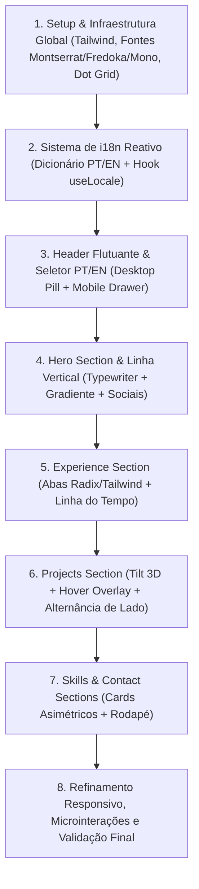

# Notas de Implementação e Planejamento Operacional

Este documento orienta a estratégia de desenvolvimento para a próxima etapa de construção do portfólio pessoal de Pedro Salles, com base na auditoria rigorosa de `https://rython.dev/` e `https://ezefaz.com/en`.

---

## 1. O Que Já Está Pronto e Validado

1. **Conteúdo Estruturado e Traduzido:**
   - O arquivo `CONTENT_atualizado.md` contém todos os textos em `pt-BR` e `en` para todas as seções (Hero, Experiência, Formação, Extracurricular, Projetos, Skills, Contato e Copyright).
2. **Assets dos Projetos Disponíveis:**
   - 5 imagens de projetos em alta resolução (1920px) em `assets/projects/`:
     - `quelin-joias.png`
     - `orbitalauto.png`
     - `infosigaa-site.png`
     - `music-downloader.png`
     - `sabor-dos-anjos.png`
3. **Referências Visuais e Vídeos:**
   - Gravações completas de interação em Desktop (`site-inspiracao-desktop.mp4`) e Mobile (`site-inspiracao-mobile.mp4`).
   - Extração do código CSS e lógica de componentes de `rython.dev` e do seletor de idioma de `ezefaz.com/en`.

---

## 2. O Que Pode Ficar Pendente Sem Bloquear a Implementação

* **Foto Final de Pedro (Home & Contact):** Pode-se utilizar temporariamente um avatar moderno/placeholder com as dimensões exatas e a mesma composição visual (80x80px na Home, 150x150px no Contact com a borda ciano).
* **Arquivo PDF do Currículo Final:** O botão "Ver currículo" / "View Resume" pode ser estruturado para disparar evento ou link com placeholder (`#` ou download simulado) até o arquivo PDF ser fornecido.

---

## 3. Estratégia Recomendada para Implementação

Recomenda-se a seguinte ordem de execução modular:

### Etapa 1: Infraestrutura Global e Layout Base
* Configuração do tema com paleta exata (`#101010`, `#1d1c20`, `#72ffff`, etc.).
* Definição da textura global de fundo `radial-gradient(circle, #303030 1px, transparent 1px)` com repetição de 20px.
* Carregamento das fontes (Montserrat, Fredoka, fontes mono do sistema).

### Etapa 2: Sistema de Internacionalização (i18n)
* Estruturação de um dicionário de tradução tipado baseado em `CONTENT_atualizado.md`.
* Contexto ou hook `useLanguage` para troca instantânea de idioma e persistência no `localStorage`.

### Etapa 3: Header e Navegação
* Header Desktop com pill flutuante, blur, backdrop e efeito deslizante no hover.
* Seletor de idioma integrado no formato de micro-pill (`PT | EN`).
* Header Mobile com ícone hambúrguer animado em "X" e drawer expansível.

### Etapa 4: Seção Home
* Card centralizado com foto de perfil e nome com gradiente animado (`15s linear infinite`).
* Saudação dinâmica por horário com digitação letra a letra e cursor piscante.
* Quatro botões sociais circulares com transição `hover:invert`.
* Linha vertical animada de 70px conectando à próxima seção.

### Etapa 5: Seção Experience
* Sistema de abas (Experiência, Formação, Extracurricular) com estilo ativo/inativo.
* Linha do tempo vertical com ponto ciano e linha cinza contínua.
* Renderização dos 3 projetos independentes, formação no IFFar e certificações.

### Etapa 6: Seção Projects
* Implementação dos 5 projetos com alternância de colunas (`flex-row` / `flex-row-reverse`).
* Perspectiva CSS (`perspective: 200px`) com inclinação 3D em repouso (`rotateY(5deg)` / `rotateY(-3deg)`).
* Transição de alinhamento frontal (`transform: rotateY(0deg)`) e overlay escuro com botão no hover (Desktop).
* Renderização adaptada para Mobile (coluna única com botão abaixo da imagem).
* Enquadramento das imagens com `object-cover object-top`.

### Etapa 7: Seções Skills e Contact
* Grid assimétrico de 2 cartões para habilidades e resumo profissional com botão de currículo.
* Card de Contato com foto média, borda ciano neon, link `mailto:` e redes sociais.
* Rodapé com texto de copyright dinâmico.

### Etapa 8: Validação e Refinamento
* Validação de contraste e fluidez em 60fps.
* Teste em múltiplos breakpoints (375px, 768px, 1024px, 1440px).
* Verificação cruzada com os vídeos de referência.

---

## 4. Riscos e Pontos Sensíveis

1. **Equilíbrio Visual do Seletor de Idioma:**
   - O seletor `PT / EN` deve permanecer discreto na ponta direita do header, sem competir com a navegação principal nem forçar quebra de linha em telas intermediárias.
2. **Enquadramento de Imagens Verticais em Containers 16:9:**
   - As imagens de `quelin-joias.png`, `orbitalauto.png`, `infosigaa-site.png` e `sabor-dos-anjos.png` são capturas de página inteira (verticais). É fundamental utilizar `object-cover object-top` e cantos arredondados (`rounded-xl`) com borda `border-gray-800` para manter a elegância do mockup.
3. **Fidelidade do Efeito 3D Tilt nos Projetos:**
   - A inclinação não deve causar estouro de viewport (*overflow-x*). É necessário manter `[perspective: 200px]` e `[perspective: 1000px]` com `overflow-hidden` ou margens calculadas.
4. **Comportamento Mobile vs Desktop:**
   - No mobile, desativar a inclinação 3D e remover a dependência de hover no overlay, garantindo que os botões de ação estejam sempre acessíveis.
