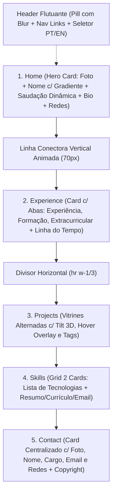
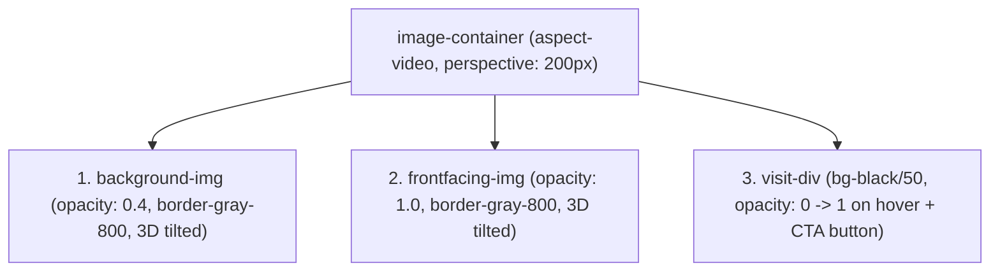

# Especificação de Referência: Rython.dev & Diretrizes Visuais

Este documento estabelece a auditoria técnica, visual e comportamental detalhada do site `https://rython.dev/`, complementada pelas referências em vídeo (`references/site-inspiracao-desktop.mp4`, `references/site-inspiracao-mobile.mp4`), pelo padrão de seletor de idioma de `https://ezefaz.com/en`, e pelo conteúdo oficial definido em `CONTENT_atualizado.md`.

---

## 1. Visão Geral e Identidade Visual

### 1.1 Estilo e Sensação Visual
* **Estética Cyber-Minimalista Dark:** Fundo escuro profundo com textura sutil em grade de pontos (*dot pattern*), superfícies em cartões com gradientes suaves de cinza escuro/preto e acentos em ciano elétrico (*neon cyan / #72ffff*).
* **Profundidade e Camadas:** Uso refinado de sombras difusas esverdeadas/azuladas (`rgba(4, 57, 57, 0.5)`), bordas translúcidas finas (`border-gray-700 / border-gray-800`), e perspectiva 3D nas vitrines de projetos.
* **Elegância Tipográfica e Microinterações:** Tipografia sem serifa com alto contraste hierárquico, efeito de digitação dinâmico (*typewriter*), gradientes animados em textos de destaque, transições suaves de posição/hover e backdrop blur no header flutuante.

### 1.2 Princípios de Design
1. **Fidelidade Visual Rigorosa:** Todos os raios de curvatura (*border-radius*), espaçamentos de container, alturas de linha e paleta de cores seguem a anatomia de `rython.dev`.
2. **Adaptação de Conteúdo:** O design é integralmente preservado, substituindo os dados de Ryan Lee pelo perfil e projetos de Pedro Salles conforme `CONTENT_atualizado.md`.
3. **Bilinguismo Nativo e Fluido:** Inclusão de seletor `PT / EN` discreto no header (inspirado em `ezefaz.com/en`), com troca de estado reativa e sem recarregamento de página.

---

## 2. Estrutura da Página e Mapeamento de Seções

A página segue fluxo linear de rolagem contínua com 5 seções principais conectadas verticalmente:



### 2.1 Mapeamento Detalhado por Seção

#### Seção 1: Home (`#home`)
* **Layout:** Container centralizado (`w-[90%] md:w-[600px] lg:w-1/2`), `pt-32 pb-0`.
* **Card:** Fundo em gradiente `bg-gradient-to-br from-[#101010] to-[#202020]`, cantos `rounded-xl`, sombra `box-shadow: 0 10px 25px 10px rgba(4, 57, 57, 0.5)`.
* **Composição Interna:**
  1. **Cabeçalho do Hero:** Foto de perfil redonda (80x80px, `rounded-full bg-[#505050]`) à esquerda; à direita: Nome em destaque com gradiente animado + Cargo.
     - *Pedro Salles:* Nome "**Pedro Salles**" com gradiente ciano-turquesa-azul; Cargo: "**Desenvolvedor de Software**" (PT) / "**Software Developer**" (EN).
  2. **Saudação Dinâmica:** Título em `text-2xl font-bold mt-5 mb-5` com efeito de digitação baseado no horário local do visitante:
     - `05:00–11:59`: "Bom dia!" / "Good morning!"
     - `12:00–17:59`: "Boa tarde!" / "Good afternoon!"
     - `18:00–04:59`: "Boa noite!" / "Good evening!"
     - Inclui cursor piscante `|` (`animate-pulse font-extralight`) que desaparece ao término da animação.
  3. **Apresentação:** Texto descritivo (`text-left text-white leading-relaxed`).
  4. **Links Sociais:** Linha inferior centralizada com botões circulares brancos (32x32px, `rounded-full bg-white text-black`), ícones em preto com transição `transition-[filter] duration-150 hover:invert`. Quatro redes:
     - GitHub (`https://github.com/pedroSalles08`)
     - E-mail (`mailto:encarnacaosalless@gmail.com`)
     - WhatsApp (`https://wa.me/5555999214159`)
     - Instagram (`https://www.instagram.com/ph.salles__/`)

#### Elemento de Conexão: Linha Vertical Animada
* **Elemento:** Linha vertical de 70px (`#line-container` e `#line`, `w-[1px] h-[70px]`) que liga a base do card da Home ao topo da seção de Experiência.
* **Animação:** `linear-gradient(#404040 0%, #aaa 5%, #404040 10%)`, `background-size: 100% 200%`, `animation: 2s linear infinite gradientAnimation` simulando pulso de luz descendo pela linha.

#### Seção 2: Experience (`#experience`)
* **Layout:** `scroll-mt-24 flex flex-col items-center justify-center`. Divisor horizontal inicial (`<hr class="mx-auto mb-10 h-[1px] w-1/3 border-[#404040]">`).
* **Estrutura de Abas:** Componente de abas (`w-[90%] md:w-[600px] lg:w-2/3`) contendo barra de navegação no topo com fundo `#101010` e 3 gatilhos:
  - Aba 1: **Experiência** / **Experience**
  - Aba 2: **Formação** / **Education**
  - Aba 3: **Extracurricular** / **Extracurricular**
  - *Estilo das abas ativas:* `bg-secondary (#1d1c20)` com borda sutil e sombra; inativo: `hover:bg-secondary/20`.
* **Painel de Conteúdo:** Fundo em gradiente suave `bg-gradient-to-bl from-[#101010] via-[#272727] to-[#181818]`, `rounded-md px-5 py-5`.
* **Linha do Tempo Interna:**
  - Cada item possui coluna de status com ponto ciano (`bg-accent h-2 w-2 rounded-full`) conectado a uma linha vertical cinza contínua (`w-[1px] flex-grow bg-gray-700`).
  - Título do cargo/curso em `text-lg font-bold`, metadados (período com ícone de calendário, local/tipo com ícone de mapa) em `text-xs text-muted-foreground (#ccc)`.
  - Lista com bullets (`list-inside list-disc text-sm space-y-1 text-gray-200`).
* **Conteúdo Mapeado de Pedro Salles:**
  - *Aba Experiência:* 3 projetos independentes: **OrbitalAuto**, **InfoSIGAA**, **Quelin Joias**.
  - *Aba Formação:* **Curso Técnico em Informática Integrado ao Ensino Médio** (IFFar — Campus Júlio de Castilhos).
  - *Aba Extracurricular:* **HTML5 e CSS3** (Curso em Vídeo), **Algoritmos e Lógica de Programação** (Udemy / Nelio Alves), **Fundamentos em Redes de Computadores** (Cisco NetAcad / IFFar).

#### Seção 3: Projects (`#projects`)
* **Layout:** `scroll-mt-12 pt-20`, Título principal `text-center text-5xl font-bold mb-10` ("Projects" / "Projetos").
* **Container:** `w-full max-w-[1440px] flex flex-col items-center [perspective:1000px]`.
* **Disposição dos Itens:** Alternância entre linhas diretas (`flex-row`) e invertidas (`flex-row-reverse`):
  - **Item 1 (Esquerda):** Imagem à esquerda com inclinação 3D positiva (`rotateY(5deg)`), texto à direita alinhado à esquerda.
  - **Item 2 (Direita):** Imagem à direita com inclinação 3D negativa (`rotateY(-3deg)`), texto à esquerda alinhado à direita.
  - **Item 3 (Esquerda):** Imagem à esquerda, texto à direita.
  - **Item 4 (Direita):** Imagem à direita, texto à esquerda.
  - **Item 5 (Esquerda):** Imagem à esquerda, texto à direita.
* **Projetos Mapeados (5 itens):**
  1. **Quelin Joias** (Tags: React, Cloudflare Pages, Cloudflare D1 | CTA: `https://quelin-joias.pages.dev/`)
  2. **OrbitalAuto** (Tags: Next.js, FastAPI, Automation | CTA: `https://orbitalauto.onrender.com/`)
  3. **InfoSIGAA** (Tags: JavaScript, Chrome Extension, Manifest V3 | CTA: `https://pedrosalles08.github.io/InfoSIGAA/`)
  4. **Music Downloader** (Tags: Python, PySide6, yt-dlp | CTA: Sem link externo provisoriamente)
  5. **Sabor dos Anjos** (Tags: React, PWA, IndexedDB | CTA: Sem link externo provisoriamente)

#### Seção 4: Skills (`#skills`)
* **Layout:** `scroll-mt-16 pt-20`, Título `text-5xl font-bold mb-5`.
* **Grid de 2 Cartões:** `grid w-[90%] md:w-[600px] lg:w-2/3 grid-cols-1 lg:grid-cols-3 gap-x-10 gap-y-5`.
  - **Card Esquerdo (1 coluna):** `bg-gradient-to-br from-[#101010] to-[#202020] rounded-xl p-5`, sombra `rgba(4, 57, 57, 0.5)`.
    - Grupo 1: *Frontend* (TypeScript, React, Next.js, Tailwind CSS, JavaScript)
    - Grupo 2: *Backend* (Python, FastAPI, SQLite, Cloudflare Pages Functions)
    - Grupo 3: *Tools* (Git, Docker, GitHub Actions)
  - **Card Direito (2 colunas - `lg:col-span-2`):** `bg-gradient-to-br from-[#202020] to-[#101010] rounded-xl p-5`, sombra `rgba(4, 57, 57, 0.5)`.
    - Parágrafos de texto sobre atuação (Web, automações Python, extensões, desktop Windows).
    - Menção a envio de currículo e contato por e-mail.
    - Botão CTA: "Ver currículo" / "View Resume" (`rounded-lg bg-white text-black font-semibold px-4 py-2 hover:bg-neutral-200 transition-colors`).
    - Link de e-mail inline destacado.

#### Seção 5: Contact (`#contact`)
* **Layout:** `pt-20 pb-16 flex flex-col items-center justify-center`.
* **Card Principal:** `w-[90%] md:w-[600px] lg:w-2/3`, `bg-gradient-to-br from-[#101010] via-[#252525] to-[#101010] rounded-xl p-8`, sombra `rgba(4, 57, 57, 0.5)`.
* **Elementos:**
  1. Foto de perfil circular média (150x150px, `rounded-full border-2 border-accent (#72ffff) object-cover`).
  2. Nome: `text-3xl font-bold text-white mb-2` ("Pedro Salles").
  3. Cargo: `text-xl text-muted-foreground (#ccc)` ("Desenvolvedor de Software" / "Software Developer").
  4. Bloco de E-mail: Rótulo "Entre em contato:" / "Email me at:" seguido pelo link interativo em destaque `encarnacaosalless@gmail.com` (`mailto:`).
  5. Links sociais: Quatro botões circulares brancos com efeito invert no hover (GitHub, Instagram, WhatsApp, E-mail).
* **Rodapé / Copyright:** Fora do card, centralizado abaixo:
  - `text-xs text-muted-foreground mt-10`: "Copyright © 2026 Pedro Salles. Todos os direitos reservados." / "Copyright © 2026 Pedro Salles. All Rights Reserved."

---

## 3. Header e Navegação (Com Seletor PT / EN Integrado)

### 3.1 Anatomia Desktop (Telas >= 768px / `md:flex`)
* **Posição:** `fixed top-5 left-1/2 -translate-x-1/2 z-50`.
* **Estrutura Visual:** Cápsula flutuante (*pill*) com `bg-[#1d1c20]/50` (`rgba(29, 28, 32, 0.5)`), `backdrop-blur-md`, borda `border-2 border-gray-700`, cantos `rounded-[40px]`, espaçamento `px-5 py-2.5`.
* **Itens de Navegação:** Lista horizontal com 5 âncoras:
  - `Home` (`#home`)
  - `Experience` / `Experiência` (`#experience`)
  - `Projects` / `Projetos` (`#projects`)
  - `Skills` / `Habilidades` (`#skills`)
  - `Contact` / `Contato` (`#contact`)
* **Microinteração de Hover/Ativo:** Pill deslizante de fundo branco com efeito de texto `mix-blend-difference` ou indicador animado com transição elástica suave (`ease-out duration-300`).

### 3.2 Integração do Seletor de Idioma (`PT / EN`)
Inspirado na precisão e discrição visual de `ezefaz.com/en`:
* **Desktop:** Inserido na extremidade direita da barra de navegação, separado por um divisor vertical sutil (`w-[1px] h-4 bg-gray-700 mx-2`):
  - Container do seletor: Micro-pill com `flex items-center gap-1 rounded-full border border-gray-700/80 bg-black/40 p-1`.
  - Botão Ativo: `rounded-full px-2.5 py-0.5 text-[11px] font-mono font-semibold tracking-wider bg-white text-black transition-all duration-300 shadow-sm`.
  - Botão Inativo: `rounded-full px-2.5 py-0.5 text-[11px] font-mono font-medium tracking-wider text-gray-400 hover:text-white transition-all duration-300`.
* **Comportamento:** Alternância instantânea via estado reativo (sem recarregar a página) com persistência em `localStorage` (`locale: "pt-BR" | "en"`).

### 3.3 Anatomia Mobile (Telas < 768px)
* **Barra Fechada:** Cápsula flutuante superior `w-[90%] max-w-[400px] h-14 flex items-center justify-between px-5 bg-[#1d1c20]/80 backdrop-blur-xl border-2 border-gray-700 rounded-full`.
* **Ícone Hambúrguer:** Animação refinada de 2 linhas horizontais (largura 28px, altura 2.5px, cor branca) com transição `cubic-bezier(0, 0, 0, 1) 0.4s` que cruzam formando um "X" ao abrir.
* **Drawer Aberto:** Expansão vertical suave do container com os 5 links verticais centralizados (`text-lg py-2.5 text-gray-200 hover:text-white font-medium`) e, na base, o seletor `PT / EN` em destaque no formato de dois botões ovais lado a lado.

---

## 4. Tipografia e Escalas

### 4.1 Famílias Tipográficas
* **Fonte Principal (Textos, Links, Parágrafos):** `Montserrat`, `ui-sans-serif`, `system-ui`, `sans-serif`
* **Fonte Secundária / Destaques Especiais:** `Fredoka`, `sans-serif` (usada em pequenos widgets/labels) e `Antonio`
* **Fonte Mono (Seletor PT/EN, Códigos, Badges):** `ui-monospace`, `SFMono-Regular`, `Menlo`, `Monaco`, `Consolas`, `monospace`

### 4.2 Hierarquia e Tamanhos

| Elemento | Tamanho Tailwind | Font Size (px/rem) | Weight | Line Height | Cor Principal |
| :--- | :--- | :--- | :--- | :--- | :--- |
| **Títulos de Seção (H1)** | `text-5xl` | 3rem (48px) | Bold (700) | 1.0 | `#fafafa` (Branco Puro) |
| **Títulos de Projetos (H2)** | `text-3xl` | 1.875rem (30px) | Bold (700) | 1.2 | `#fafafa` |
| **Nome Hero / Contact** | `text-2xl / text-3xl` | 1.5rem / 1.875rem | Bold (700) | 1.2 | Gradiente Animado / `#fafafa` |
| **Saudação Dinâmica** | `text-2xl` | 1.5rem (24px) | Bold (700) | 1.3 | `#fafafa` |
| **Subtítulos / Cargos** | `text-xl` | 1.25rem (20px) | Medium / Regular | 1.4 | `#ccc` / `#fafafa` |
| **Títulos de Experiência / Abas** | `text-lg` | 1.125rem (18px) | SemiBold / Medium | 1.4 | `#fafafa` |
| **Corpo de Texto / Bio** | `text-base / text-xl (proj)` | 1rem / 1.25rem | Regular (400) | 1.6 / 1.5 | `#fafafa` / `#e5e5e5` |
| **Metadados (Datas, Locais)** | `text-xs` | 0.75rem (12px) | Regular (400) | 1.3 | `#ccc` (Muted Foreground) |
| **Tags de Tecnologias** | `text-xs / text-sm` | 0.75rem / 0.875rem | Medium / Bold | 1.0 | `#000000` em fundo `#72ffff` |
| **Seletor de Idioma** | `text-[11px]` | 11px | Mono Medium | 1.0 | `#000` (ativo) / `#888` (inativo) |

---

## 5. Cores, Superfícies e Efeitos

### 5.1 Paleta de Cores do Sistema

```text
┌────────────────────────────────────────────────────────────────────────┐
│  Fundo da Página: #101010  (com pontos radiais 1px #303030 a cada 20px) │
├────────────────────────────────────────────────────────────────────────┤
│  Superfície Primária (Cards): Gradiente #101010 ───► #202020           │
│  Superfície Secundária (Nav/Tabs): #1d1c20 (com 50% a 80% de opacidade) │
├────────────────────────────────────────────────────────────────────────┤
│  Acento Principal (Cyan Neon): #72ffff                                 │
│  Acento Secundário (Verde/Azul Gradiente): #20ffb8 ───► #0096ff        │
├────────────────────────────────────────────────────────────────────────┤
│  Texto Principal: #fafafa (Branco)                                      │
│  Texto Suave / Muted: #cccccc (Cinza Claro)                            │
│  Bordas Estruturais: #374151 (gray-700) / #1f2937 (gray-800)           │
│  Sombra Glow de Cartões: rgba(4, 57, 57, 0.5)                          │
└────────────────────────────────────────────────────────────────────────┘
```

### 5.2 Texturas e Efeitos de Fundo
* **Dot Pattern Global (Body):**
  ```css
  background-color: #101010;
  background-image: radial-gradient(circle, #303030 1px, transparent 1px);
  background-size: 20px 20px;
  background-repeat: repeat;
  ```
* **Glow dos Cartões:**
  ```css
  box-shadow: 0 10px 25px 10px rgba(4, 57, 57, 0.5);
  ```
* **Texto com Gradiente Animado (Nome Hero):**
  ```css
  background: linear-gradient(90deg, #72ffff 0%, #20ffb8 55%, #0096ff 100%) 0 0 / 200% text;
  -webkit-text-fill-color: transparent;
  animation: gradient 15s ease infinite;
  ```

---

## 6. Seção Projects: Anatomia 3D, Hover e Avaliação de Assets

### 6.1 Mecânica de Perspectiva 3D e Hover

O efeito de vitrine do Rython é composto por 3 camadas sobrepostas dentro de um container com `aspect-video` (16:9) e perspectiva CSS:



#### Parâmetros de Transformação CSS:
* **Disposição Esquerda (Left):**
  - *Estado Inicial (Repouso):*
    ```css
    .background-img.left {
      transform: translate(calc(25px - 50%), calc(5px - 50%)) translateZ(-50px) rotateY(5deg);
      opacity: 0.4;
    }
    .frontfacing-img.left {
      transform: translate(calc(35px - 50%), -50%) translateZ(-50px) rotateY(5deg);
      opacity: 1.0;
    }
    ```
* **Disposição Direita (Right):**
  - *Estado Inicial (Repouso):*
    ```css
    .background-img.right {
      transform: translate(-50%, calc(5px - 50%)) translateZ(-50px) rotateY(-3deg);
      opacity: 0.4;
    }
    .frontfacing-img.right {
      transform: translate(calc(-50% - 10px), -50%) translateZ(-50px) rotateY(-3deg);
      opacity: 1.0;
    }
    ```
* **Estado Ativo no Hover (Desktop):**
  - Imagem alinha-se perfeitamente de frente:
    ```css
    .image-container:hover > img,
    .image-container:hover > video {
      transform: rotateY(0deg) rotateX(0deg) translateZ(0px) translate(-50%, -50%);
      transition: transform 0.5s ease-in-out;
    }
    ```
  - Overlay escurece e revela o botão central:
    ```css
    .image-container:hover > .visit-div {
      opacity: 1;
      transition: opacity 0.3s ease-in-out 0.3s;
    }
    ```
  - Botão CTA Central: `rounded-xl border-2 border-accent (#72ffff) bg-black text-accent px-5 py-3 font-bold hover:bg-accent hover:text-black transition-colors duration-300`.

* **Comportamento em Mobile (< 1024px):**
  - Sem efeito 3D inclinado (transformação neutra).
  - O botão CTA não fica sobre a imagem (não há hover), mas é renderizado imediatamente abaixo da imagem como botão de destaque (`rounded-4xl bg-blue-600 px-5 py-3 font-bold text-white hover:bg-white hover:text-accent`).

---

### 6.2 Avaliação Técnica dos Assets (`assets/projects/`)

Foram inspecionadas as 5 imagens de projetos presentes no repositório:

| Arquivo | Resolução Original | Proporção (W:H) | Diagnóstico Visual & Enquadramento | Classificação de Prontidão | Ação Recomendada |
| :--- | :--- | :--- | :--- | :--- | :--- |
| **`quelin-joias.png`** | 1920 x 2197 | 0.87 (Vertical) | Captura de alta fidelidade da vitrine web. A parte superior (banner + primeiros produtos) é rica visualmente. | **Pronta para uso** (com enquadramento superior) | Utilizar `object-cover object-top` no container 16:9. |
| **`orbitalauto.png`** | 1920 x 2411 | 0.80 (Vertical) | Captura nítida do painel/dashboard da aplicação de automação. Header e formulários de agendamento têm alto apelo visual. | **Pronta para uso** (com enquadramento superior) | Utilizar `object-cover object-top` no container 16:9. |
| **`infosigaa-site.png`** | 1920 x 3080 | 0.62 (Vertical longa) | Captura da landing page de apresentação da extensão. O topo contém hero com visual escuro condizente com o portfólio. | **Pronta para uso** (com enquadramento superior) | Utilizar `object-cover object-top`. |
| **`music-downloader.png`** | 1919 x 984 | 1.95 (Horizontal ~16:9) | Captura da janela do app Windows. Proporção quase exata de 16:9 (1.95), encaixe perfeito sem cortes. | **Pronta para uso imediato** | Encaixe natural no container 16:9 (`object-cover`). |
| **`sabor-dos-anjos.png`** | 1920 x 2030 | 0.95 (Vertical) | Captura de tela do PWA/dashboard da confeitaria. Exibe cartões de métricas, receitas e estoque. | **Pronta para uso** (com enquadramento superior) | Utilizar `object-cover object-top`. |

> [!NOTE]
> Todas as 5 imagens possuem excelente resolução (1920px de largura) e qualidade gráfica adequada para a vitrine. A aplicação de `object-fit: cover` combinado com `object-position: top` garante que o cabeçalho e a identidade visual de cada projeto fiquem visíveis no formato 16:9 do layout do Rython sem distorção.

---

## 7. Seção Skills: Estrutura e Proporções

* **Composição Grid:** `grid-cols-1 lg:grid-cols-3 gap-x-10 gap-y-5`.
* **Card 1: Lista Técnica (1 coluna no Desktop):**
  - Fundo em gradiente `from-[#101010] to-[#202020]`, cantos `rounded-xl`, borda sutil e sombra glow.
  - 3 blocos empilhados:
    1. **Frontend:** `TypeScript, React, Next.js, Tailwind CSS, JavaScript`
    2. **Backend:** `Python, FastAPI, SQLite, Cloudflare Pages Functions`
    3. **Tools:** `Git, Docker, GitHub Actions`
  - Título de cada grupo em `text-xl font-bold text-white`, itens em `text-sm text-gray-300`.
* **Card 2: Resumo Profissional & Ações (2 colunas no Desktop - `lg:col-span-2`):**
  - Fundo em gradiente `from-[#202020] to-[#101010]`, cantos `rounded-xl`, sombra glow.
  - Texto de síntese em 3 parágrafos explicando foco em desenvolvimento web (full stack), automações em Python, extensões e apps desktop.
  - Linha de ação com botão **"Ver currículo"** / **"View Resume"** (`bg-white text-black font-semibold rounded-lg px-5 py-2.5 hover:bg-gray-200 transition-colors`) e link com e-mail destacado.

---

## 8. Seção Contact: Estrutura e Simplicidade

* **Card Centralizado Unificado:** Segue a mesma assinatura estética da Home para criar fechamento harmonioso da página.
* **Foto de Perfil:** 150x150px circular com borda neon `border-2 border-accent (#72ffff)`.
* **Nome e Cargo:** "Pedro Salles" (`text-3xl font-bold`) e "Desenvolvedor de Software" (`text-xl text-muted-foreground`).
* **Canal Direto:** Bloco "Entre em contato:" / "Email me at:" seguido pelo link interativo em destaque `encarnacaosalless@gmail.com` (`mailto:`).
* **Redes Sociais:** Quatro botões circulares brancos com ícones pretos e transição `hover:invert` (GitHub, Instagram, WhatsApp, E-mail).
* **Copyright:** Fora do card, no rodapé inferior: `Copyright © 2026 Pedro Salles. Todos os direitos reservados.`

---

## 9. Responsividade e Breakpoints

| Breakpoint | Faixa de Largura | Comportamento do Header | Comportamento da Seção Projects | Comportamento das Abas / Skills |
| :--- | :--- | :--- | :--- | :--- |
| **Mobile** | `< 768px` | Barra compacta com hambúrguer animado; drawer com links verticais e seletor `PT / EN`. | Coluna única; imagens centralizadas sem inclinação 3D; botão CTA exibido abaixo da imagem. | Abas ocupam 90% da largura; Skills em coluna única empilhada. |
| **Tablet** | `768px – 1023px` | Header em cápsula horizontal visível (`w-11/12`); links horizontais sem dropdown. | Imagens e textos começam a empilhar verticalmente mantendo largura de container de 600px. | Skills em coluna única ou 2 colunas adaptadas. |
| **Desktop** | `1024px – 1279px` | Header flutuante completo (`w-2/3`) com indicador deslizante de hover e seletor `PT / EN`. | Alternância lado a lado (`flex-row` / `flex-row-reverse`); inclinação 3D ativa com hover overlay e CTA central. | Skills em 3 colunas (1 col lista técnica + 2 col resumo). |
| **Wide Desktop** | `>= 1280px` | Header flutuante compacto auto-ajustável (`xl:w-auto`). | Layout expandido até `max-w-[1440px]` com paddings generosos (`px-20`). | Largura máxima proporcional com leitura equilibrada. |

---

## 10. Matriz de Animações e Microinterações

| Elemento | Gatilho (*Trigger*) | Estado Inicial | Estado Final | Duração | Easing / Curva | Observação do Vídeo de Referência |
| :--- | :--- | :--- | :--- | :--- | :--- | :--- |
| **Saudação (Typewriter)** | Carregamento da página | String vazia `""` | Saudação completa + cursor | 50ms por caractere | Linear | O cursor `|` pisca durante a digitação e desaparece no final. |
| **Nome (Gradiente)** | Contínuo / Infinito | `background-position: 0%` | `background-position: 200%` | 15s | Linear infinito | Transição de tons ciano/esmeralda/azul suave. |
| **Linha Vertical Conectora** | Contínuo / Infinito | Posição superior do gradiente | Posição inferior (-100%) | 2s | Linear infinito | Dá a sensação de corrente elétrica descendo para a Experiência. |
| **Header Pill Hover** | Mouse enter no link da nav | Sem pill de fundo | Pill branca sob o texto | 300ms | `cubic-bezier(0,0,0.2,1)` | Texto inverte cor via `mix-blend-difference`. |
| **Botão Hambúrguer Mobile** | Clique no menu | Duas barras paralelas horizontais | Linhas cruzadas formando "X" | 400ms | `cubic-bezier(0,0,0,1)` | Movimento fluido capturado no vídeo mobile. |
| **Drawer Menu Mobile** | Abertura do menu | `max-h-0 opacity-0 -translate-y-2` | `max-h-[400px] opacity-100 translate-y-0` | 500ms | `cubic-bezier(0.22,1,0.36,1)` | Expansão com desfoque de fundo. |
| **Troca de Aba (Experience)** | Clique na aba | Painel anterior | Novo painel com fade-in | 300ms | `ease-in-out` | Transição rápida mantendo altura estável. |
| **Projetos: 3D Tilt (Desktop)** | Mouse hover no card de imagem | Inclinado (`rotateY(5deg)` ou `-3deg`) | Reto (`rotateY(0deg) translateZ(0)`) | 500ms | `ease-in-out` | A imagem se projeta suavemente para o usuário. |
| **Projetos: Overlay Escuro** | Mouse hover no card de imagem | `opacity: 0` | `opacity: 1` | 300ms (delay 300ms) | `ease-in-out` | O botão "Visit Site" surge sobre o fundo escurecido. |
| **Botões Sociais Circulares** | Mouse hover | Fundo branco, ícone preto | Fundo preto, ícone branco (`invert`) | 150ms | `ease` | Resposta tátil rápida e minimalista. |
| **Seletor de Idioma (PT/EN)** | Clique em PT ou EN | Idioma anterior | Idioma novo com micro-pill ativa | 200ms | `ease-out` | Troca instantânea de todo o texto da página sem scroll jump. |

---

## 11. Checklist de Fidelidade e Critérios de Aceite

- [x] **Fundo e Textura:** Fundo `#101010` com radial dot grid de 20px `#303030`.
- [x] **Header Desktop:** Cápsula flutuante com blur, borda cinza, navegação interativa e seletor `PT / EN` integrado de forma harmônica.
- [x] **Header Mobile:** Menu compacto com animação de hambúrguer em "X" e gaveta expansível fluida.
- [x] **Home:** Card centralizado com foto, nome em gradiente, saudação por horário com typewriter, bio e 4 botões sociais circulares invertíveis.
- [x] **Conexão:** Linha vertical conectora com gradiente animado contínuo entre Home e Experiência.
- [x] **Experience:** Abas funcionais (Experiência, Formação, Extracurricular) com linha do tempo vertical pontilhada em ciano e metadados organizados.
- [x] **Projects:** 5 projetos alternados esquerda/direita com perspectiva 3D, hover straighten, overlay escuro com botão central no desktop e botão fixo no mobile.
- [x] **Skills:** Grid de 2 cards assimétricos com listas categorizadas e resumo com botão de currículo.
- [x] **Contact:** Card central com foto com borda ciano neon, nome, cargo, e-mail clicável, redes sociais e copyright inferior.
- [x] **Internacionalização (i18n):** Todo o conteúdo de `CONTENT_atualizado.md` mapeado para `pt-BR` e `en`, alternável sem reload e persistido em `localStorage`.
